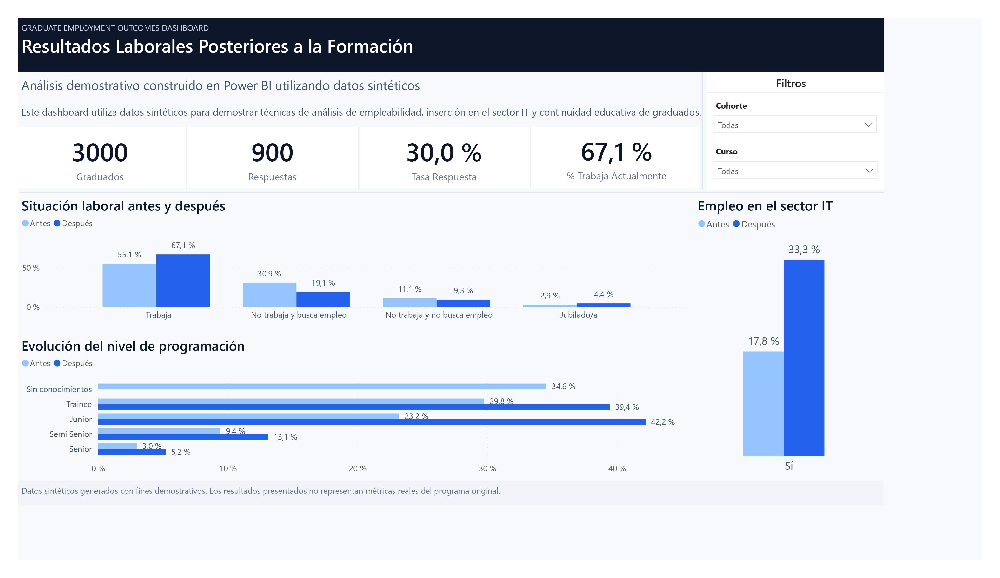
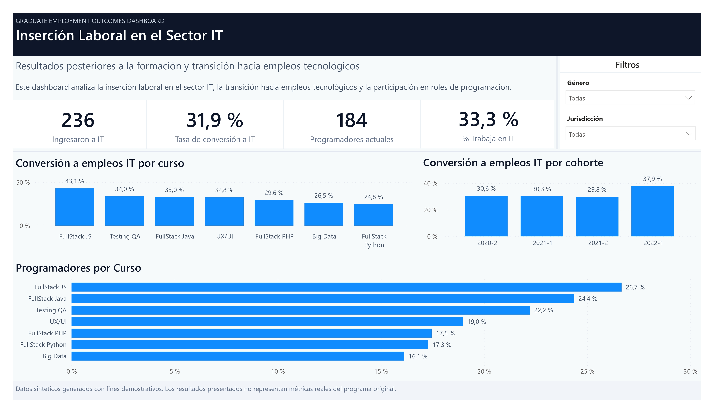
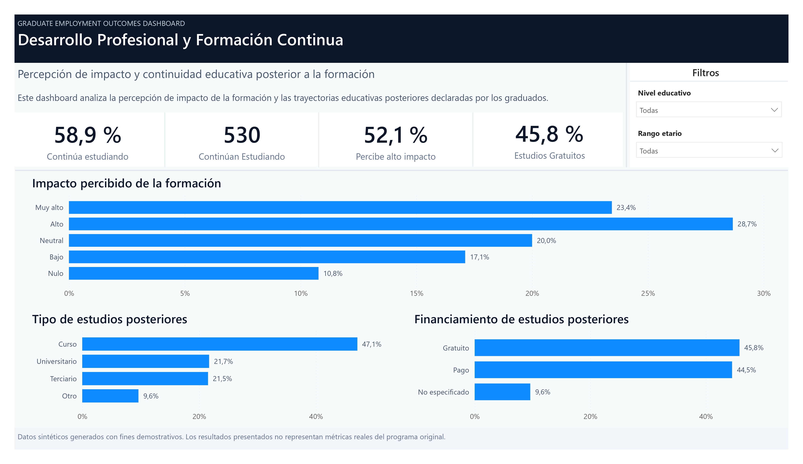
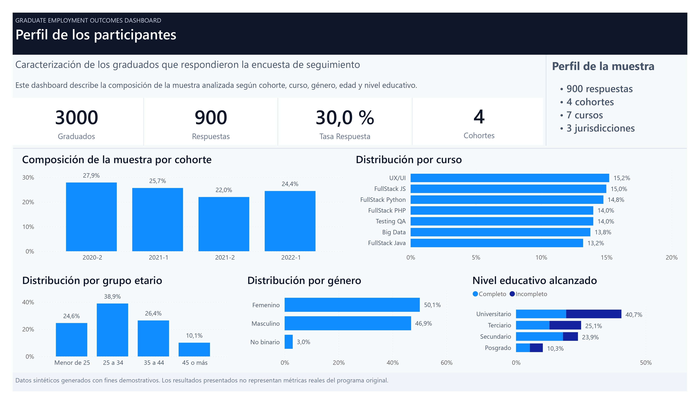

# Graduate Employment Outcomes Dashboard

**Language:** [Español](README.md) | English

Employment outcomes, IT sector insertion, and continuing education analysis using Power BI.

---

## Description

This project presents an analytical dashboard developed in Power BI to evaluate employment outcomes after graduation from a technology training program.

The analysis combines graduate records and follow-up survey results collected from former participants, enabling the evaluation of employment status changes, IT sector insertion, continuing education, and perceived skill development.

The public version of this repository uses synthetic and anonymized data for demonstration purposes only.

---

## Objective

The objective of this project is to measure post-graduation outcomes and answer questions such as:

* What proportion of graduates obtained employment after completing the program?
* How many entered the technology sector?
* How many transitioned into IT-related jobs?
* How did participants' perceived programming skills evolve over time?
* How many continued their education after graduation?

This project demonstrates employability analysis, graduate tracking, data modeling, and dashboard design techniques using Power BI.

---

## Quick Start

1. Open `dashboard/graduate_employment_outcomes.pbix` in Power BI Desktop.
2. The demonstration datasets are located in `data/synthetic/`.
3. To regenerate them from the repository root, run:

```powershell
python scripts/generate_synthetic_data.py
```

The script generates and validates `graduates_synthetic.csv` (3,000 records) and `survey_synthetic.csv` (900 responses), replacing the existing files with reproducible output.

---

## Dashboard

### 1. Employment Outcomes

Analysis of employment status before and after training, workforce participation, and changes in self-reported programming skill levels.



---

### 2. IT Sector Insertion

Analysis of transitions into technology-related jobs, IT employment conversion rates, and programming roles by cohort and course.



---

### 3. Professional Development and Continuing Education

Analysis of continuing education, perceived training impact, and characteristics of post-program studies pursued by graduates.



---

### 4. Participant Profile

Demographic and educational profile of survey respondents used to contextualize the dashboard results.



---

## Key Dimensions Analyzed

* Gender
* Age
* Region / Jurisdiction
* Training Course
* Cohort
* Educational Attainment

---

## Key Indicators

* Survey response rate
* Post-graduation employment rate
* IT sector employment
* Programming-related employment
* Career transition into IT
* Programming skill progression
* Post-graduation continuing education

---

## Tools and Technologies

* Power BI
* Power Query
* DAX
* Excel
* Dimensional Data Modeling

---

## My Contribution

I participated in all stages of the project.

### Evaluation Design

* Defined evaluation objectives together with program stakeholders.
* Designed indicators to measure employability, IT sector insertion, and continuing education outcomes.
* Contributed to the design of the follow-up survey questionnaire.
* Coordinated with communication teams to support graduate outreach campaigns.
* Monitored response rates and sample coverage.

### Data Preparation and Modeling

* Built and cleaned analytical datasets.
* Developed the data model.
* Performed transformations and enrichment using Power Query.
* Created KPIs and analytical measures using DAX.

### Dashboard Development

* Designed and developed the Power BI dashboard.
* Produced analytical insights and conclusions to support program evaluation.

---

## Repository Structure

```text
dashboard/
├── graduate_employment_outcomes.pbix

data/
├── synthetic/
├── data_dictionary.md
├── graduates_schema.md
└── survey_schema.md

docs/
├── graduate_employment_outcomes.pdf
└── methodology.md

images/
├── cover.jpg
├── 01_employment_outcomes.jpg
├── 02_it_sector_insertion.jpg
├── 03_professional_development.jpg
└── 04_participant_profile.jpg

scripts/
├── generate_synthetic_data.py
└── README.md

README.md
README_EN.md
```

---

## Methodological Considerations

The survey was conducted across multiple graduate cohorts through a follow-up questionnaire administered after program completion.

Because the evaluation was implemented after several cohorts had already graduated, response rates vary across cohorts. More recent cohorts were contacted closer to graduation, while older cohorts experienced longer time gaps between graduation and survey administration.

These differences may affect comparability across cohorts and should be considered when interpreting the results.

---

## Data Disclaimer

The original data used during the project belonged to a real-world initiative and contained personal participant information.

For this public version:

* All original data was removed.
* Personal identifiers were excluded.
* Synthetic datasets were generated and used instead.
* Reported values and results were modified or synthetically generated to preserve confidentiality.

The purpose of this repository is to showcase the analytical approach, data modeling process, and dashboard development techniques used in the project.
